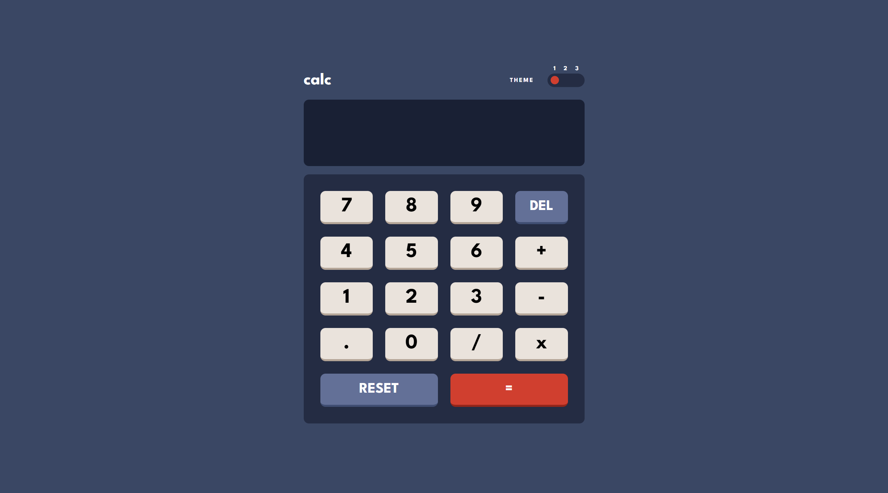

# Frontend Mentor - Calculator app solution

This is a solution to the [Calculator app challenge on Frontend Mentor](https://www.frontendmentor.io/challenges/calculator-app-9lteq5N29). Frontend Mentor challenges help you improve your coding skills by building realistic projects.

## Table of contents

- [Overview](#overview)
  - [The challenge](#the-challenge)
  - [Screenshot](#screenshot)
  - [Links](#links)
- [My process](#my-process)
  - [Built with](#built-with)
  - [What I learned](#what-i-learned)
  - [Continued development](#continued-development)
- [Author](#author)

## Overview

### The challenge

Users should be able to:

- See the size of the elements adjust based on their device's screen size
- Perform mathmatical operations like addition, subtraction, multiplication, and division
- Adjust the color theme based on their preference
- **Bonus**: Have their initial theme preference checked using `prefers-color-scheme` and have any additional changes saved in the browser

### Screenshot



### Links

- Solution URL: [https://github.com/KH-Ray/calculator-app-main](https://github.com/KH-Ray/calculator-app-main)
- Live Site URL: [https://rainbow-sable-fcd6ea.netlify.app/](https://rainbow-sable-fcd6ea.netlify.app/)

## My process

### Built with

- Semantic HTML5 markup
- Flexbox
- CSS Grid
- [React](https://reactjs.org/) - JS library

### What I learned

```css
.numpad {
  display: grid;
  grid-template-columns: repeat(4, 10.1rem);
  grid-template-rows: repeat(5, 6.4rem);
  justify-content: space-between;
  align-content: space-between;

  height: 48rem;
  border-radius: 1rem;
  background-color: hsl(223, 31%, 20%);
  padding: 3.2rem;
}

.numpad button {
  display: flex;
  align-items: center;
  justify-content: center;

  transition: all 50ms;

  width: 10.1rem;
  border: none;
  border-radius: 1rem;
  font-family: "League Spartan", sans-serif;
}

.numpad button:hover {
  cursor: pointer;
}

.numpad button:active {
  transform: translateY(0.4rem);
  border-bottom: none;
}

.numpad .btn-main {
  background-color: hsl(30, 25%, 89%);
  border-bottom: 0.4rem solid hsl(28, 16%, 65%);
  font-size: 4rem;
}

.numpad .btn-main:hover {
  background-color: #fffffe;
}

.numpad .btn-secondary {
  background-color: hsl(225, 21%, 49%);
  border-bottom: 0.4rem solid hsl(224, 28%, 35%);
  font-size: 2.8rem;
  color: hsl(0, 0%, 100%);
}

.numpad .btn-secondary:hover {
  background-color: #a2b2e1;
}

.numpad .btn-tertiary {
  font-size: 2.8rem;
  color: hsl(0, 0%, 100%);
  background-color: hsl(6, 63%, 50%);
  border-bottom: 0.4rem solid hsl(6, 70%, 34%);
}

.numpad .btn-tertiary:hover {
  background-color: #f96b5b;
}

.btn-reset {
  grid-column: 1 / 3;
}

.btn-equals {
  grid-column: 3 / -1;
}

.btn-reset,
.btn-equals {
  width: auto !important;
}
```

```js
export default function ScreenResult({ result, pastNum, operator }) {
  let historyNum;

  switch (operator) {
    case "plus":
      historyNum = `${pastNum} + `;
      break;

    case "minus":
      historyNum = `${pastNum} - `;
      break;

    case "divide":
      historyNum = `${pastNum} / `;
      break;

    case "multiply":
      historyNum = `${pastNum} x `;
      break;

    case "reset":
      historyNum = "";
      break;

    default:
      break;
  }

  return (
    <div className="screen-result">
      <span className="screen-result-past-number">{historyNum}</span>
      <span className="screen-result-number">
        {result === Infinity || +result > 999999999999
          ? "Error"
          : result.length === undefined
          ? String(+result.toFixed(10))
          : String(result)}
      </span>
    </div>
  );
}
```

### Continued development

Haven't finish for the other color themes, will do so in the future.

## Author

- Frontend Mentor - [@UncertainlySure](https://www.frontendmentor.io/profile/UncertainlySure)
